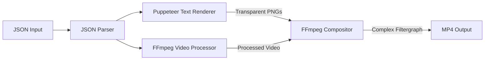
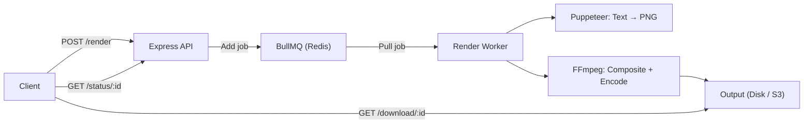

# JSON-to-MP4 Video Generation Backend Service (Revised)

A backend service that accepts a JSON composition object and renders it into an MP4 video. Must scale to **30 lakh (3 million) videos**. **Zero licensing costs.**

---

## Technology Choice: FFmpeg + Puppeteer Hybrid

> [!IMPORTANT]
> Your JSON uses CSS-styled web content (web fonts via URL, `scale(3)` transforms, box-shadow, webkit-text-stroke). Instead of paying for Remotion, we use **Puppeteer to render text as transparent PNGs** (full CSS fidelity) and **FFmpeg for video compositing/encoding** (fastest possible).

| Approach | Speed | CSS Support | Cost | Maturity |
|---|---|---|---|---|
| ~~Remotion~~ | Medium (Chrome per-frame) | ✅ Full | ⚠️ $100/mo license | ✅ |
| ~~Revideo~~ | Fast (Canvas) | ⚠️ Limited (no box-shadow, text-stroke) | ✅ Free (MIT) | ⚠️ Newer |
| ~~Pure FFmpeg~~ | ✅ Fastest | ❌ drawtext only | ✅ Free | ✅ |
| **FFmpeg + Puppeteer** | ✅ Fast | ✅ Full CSS | ✅ Free | ✅ Both battle-tested |

### Why This Is Better for 3M Videos
1. **FFmpeg encodes 5-10x faster** than frame-by-frame browser rendering
2. **Text PNGs are cacheable** — same text/style = render once, reuse forever
3. **Zero licensing cost** — both FFmpeg and Puppeteer are free
4. **Lightweight workers** — FFmpeg uses ~200MB RAM vs ~1GB for Chrome-per-frame
5. **GPU acceleration** — FFmpeg supports NVENC/VAAPI hardware encoding

---

## How It Works



**Step-by-step for your sample JSON:**
1. Parse JSON → extract 2 text items + 1 video item
2. **Text items** → Puppeteer renders each as a transparent PNG at exact `width × height` with all CSS styling (font, color, shadow, stroke)
3. **Video item** → FFmpeg downloads source video, applies `scale(3)`, trims to `0-30s`
4. **Composite** → FFmpeg overlays text PNGs on video at exact `left,top` positions, with timing (`enable='between(t,0,5)'`)
5. **Encode** → H.264 MP4 output at 1920×1080 @ 30fps

---

## Architecture



---

## Proposed Changes

### Project Setup

#### [NEW] [package.json](file:///c:/Users/Kaushik Dutta/Desktop/deployed-project/mp4-video-generator/package.json)
- Dependencies: `fluent-ffmpeg`, `puppeteer`, `express`, `bullmq`, `ioredis`, `zod`, `uuid`, `dotenv`
- TypeScript with `tsx` for dev

#### [NEW] [Dockerfile](file:///c:/Users/Kaushik Dutta/Desktop/deployed-project/mp4-video-generator/Dockerfile)
- `node:20-bookworm` base, installs Chrome + FFmpeg
- Multi-stage build for smaller image

---

### Core Rendering Engine (`src/renderer/`)

#### [NEW] [textRenderer.ts](file:///c:/Users/Kaushik Dutta/Desktop/deployed-project/mp4-video-generator/src/renderer/textRenderer.ts)
- Launches Puppeteer with a persistent browser instance (reused across renders)
- For each text item: creates an HTML page with exact CSS from JSON, screenshots as transparent PNG
- Caches PNGs by content hash (same text+style = skip re-rendering)
- Handles `{{dynamicText}}` variable replacement before rendering
- Loads custom fonts via `@font-face` with the `fontUrl` from JSON

#### [NEW] [videoCompositor.ts](file:///c:/Users/Kaushik Dutta/Desktop/deployed-project/mp4-video-generator/src/renderer/videoCompositor.ts)
- Builds FFmpeg complex filtergraph:
  - Downloads source video → scales/transforms per JSON
  - Creates 1920×1080 black base canvas
  - Overlays video layer at `left,top` position
  - Overlays each text PNG at `left,top` with `enable='between(t, fromSec, toSec)'`
- Handles `playbackRate`, `trim`, `volume` for video items
- Outputs H.264 MP4 at specified `fps`

#### [NEW] [renderPipeline.ts](file:///c:/Users/Kaushik Dutta/Desktop/deployed-project/mp4-video-generator/src/renderer/renderPipeline.ts)
- Orchestrates the full pipeline: parse JSON → render text PNGs → build filtergraph → execute FFmpeg → return MP4 path

---

### API Server (`src/server/`)

#### [NEW] [app.ts](file:///c:/Users/Kaushik Dutta/Desktop/deployed-project/mp4-video-generator/src/server/app.ts)
- Express with JSON body parsing, CORS, error handling

#### [NEW] [routes/render.ts](file:///c:/Users/Kaushik Dutta/Desktop/deployed-project/mp4-video-generator/src/server/routes/render.ts)
- **`POST /api/render`** — Validates JSON with Zod, accepts optional `dynamicFields` map, enqueues job, returns `{ jobId }`
- **`GET /api/render/:jobId/status`** — Job status + progress %
- **`GET /api/render/:jobId/download`** — Streams rendered MP4

---

### Job Queue & Worker (`src/worker/`)

#### [NEW] [queue.ts](file:///c:/Users/Kaushik Dutta/Desktop/deployed-project/mp4-video-generator/src/worker/queue.ts)
- BullMQ queue `video-render`, Redis connection config

#### [NEW] [renderWorker.ts](file:///c:/Users/Kaushik Dutta/Desktop/deployed-project/mp4-video-generator/src/worker/renderWorker.ts)
- BullMQ worker, calls `renderPipeline`, reports progress, saves output

---

### Shared (`src/shared/`)

#### [NEW] [types.ts](file:///c:/Users/Kaushik Dutta/Desktop/deployed-project/mp4-video-generator/src/shared/types.ts)
- TypeScript interfaces + Zod schemas matching JSON structure

#### [NEW] [utils.ts](file:///c:/Users/Kaushik Dutta/Desktop/deployed-project/mp4-video-generator/src/shared/utils.ts)
- `msToSeconds()`, `replaceDynamicText()`, `calculateDuration()`, `hashContent()`

---

### Infrastructure

#### [NEW] [docker-compose.yml](file:///c:/Users/Kaushik Dutta/Desktop/deployed-project/mp4-video-generator/docker-compose.yml)
- Services: `api`, `worker` (scalable replicas), `redis`

---

## Scaling Strategy for 3M Videos

| Phase | Setup | Throughput | Cost |
|---|---|---|---|
| **Phase 1** | `docker-compose --scale worker=10` | ~7,200/day | Your server costs only |
| **Phase 2** | Kubernetes + HPA on queue depth | ~72,000+/day | K8s cluster costs |
| **Phase 3** | Serverless (Cloud Run / Lambda) | Millions/day | Pay-per-render |

### Key Optimizations
1. **PNG caching** — Hash text content + style → skip Puppeteer for duplicate renders
2. **Persistent Puppeteer** — One browser instance, reuse across renders (~5s saved/render)
3. **FFmpeg hardware encoding** — NVENC on GPU instances = 3-5x faster encoding
4. **Asset CDN** — Cache source videos to avoid repeated downloads
5. **Queue priorities** — Urgent vs batch renders via BullMQ priority

---

## Verification Plan

### Automated Tests
- JSON parsing, Zod validation, `msToSeconds`, dynamic text replacement
- Integration: send sample JSON → verify MP4 exists with correct duration

### Manual Verification
```bash
# Start stack
docker-compose up

# Submit render
curl -X POST http://localhost:3000/api/render \
  -H "Content-Type: application/json" \
  -d @sample-input.json

# Check status
curl http://localhost:3000/api/render/{jobId}/status

# Download and play MP4
```
- Video background plays at correct scale
- Text overlays appear at correct positions and timings
- Dynamic text replaced correctly
- Audio from video source preserved
