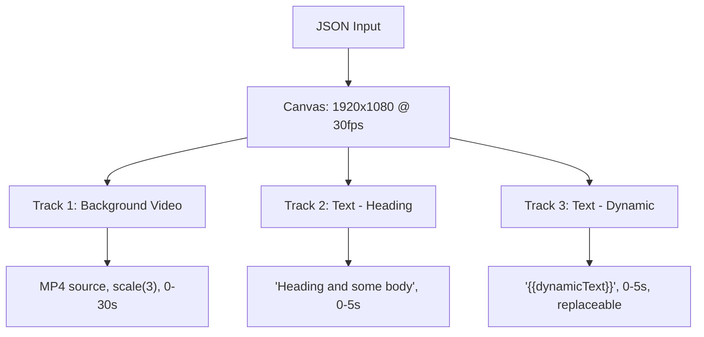

# JSON-to-MP4 Video Generation Backend Service (Remotion)

A backend service that accepts a JSON composition object (describing video layers, text overlays, styling, timing) and renders it into an MP4 video file. The system must scale to **30 lakh (3 million) videos**.

---

## Technology Choice: Why Remotion

| Criteria | Remotion | Revideo | FFmpeg (raw) |
|---|---|---|---|
| CSS text styling (fonts, shadows, transforms) | ✅ Native (React/CSS) | ⚠️ Canvas-based (limited CSS) | ❌ Complex drawtext filter |
| Web font loading (`fontUrl` in JSON) | ✅ Built-in | ⚠️ Manual | ❌ Manual fontconfig |
| Video compositing (layers, opacity) | ✅ Built-in | ✅ Built-in | ✅ overlay filter |
| Timeline/timing (`from`/`to` in ms) | ✅ `Sequence` component | ✅ Generators | ✅ `-ss`/`-t` flags |
| Scaling to 3M videos | ✅ Lambda + self-hosted workers | ⚠️ Lambda possible but manual | ✅ Lightweight per render |
| Maturity & ecosystem | ✅ Production-proven | ⚠️ Newer, less ecosystem | ✅ Decades of stability |
| Licensing | ⚠️ ~$100/mo company license | ✅ MIT | ✅ GPL/LGPL |

> [!IMPORTANT]
> **Recommendation: Remotion** — Your JSON uses CSS-styled web content (web fonts via URL, CSS transforms like `scale(3)`, `box-shadow`, `text-shadow`, pixel-based positioning). Remotion renders this natively using headless Chrome, making it the most accurate and lowest-effort solution. The `~$100/mo` Company License is negligible at 3M video scale.

---

## JSON Schema Analysis

Your JSON describes a **layered video composition**:



Key observations:
- **`trackItemsMap`** holds the authoritative item data (with `display.from/to`, `trim`, `duration`)
- **`trackItemDetailsMap`** duplicates styling details (can be used for quick lookups)
- **`tracks`** defines the **z-order** (bottom-to-top rendering)
- **`{{dynamicText}}`** pattern = template variables that should be replaceable at render time
- **Timings are in milliseconds** — need conversion to frames (`ms / 1000 * fps`)

---

## Architecture Overview

```mermaid
graph LR
    Client["Client (API call)"] -->|POST /render| API["Express API Server"]
    API -->|Add job| Queue["BullMQ Queue (Redis)"]
    Queue -->|Pull job| Worker["Render Workers (N instances)"]
    Worker -->|renderMedia()| Remotion["Remotion Renderer + Chrome"]
    Worker -->|Upload| Storage["S3 / Local Disk"]
    API -->|GET /status/:id| Queue
    API -->|GET /download/:id| Storage
```

### For Scale (3M+ videos)

Two deployment tiers:

| Tier | When to Use | Architecture |
|---|---|---|
| **Self-hosted workers** | Default, cost-effective | Docker containers with BullMQ workers. Scale horizontally by adding containers. |
| **Remotion Lambda** | Burst capacity, individual fast renders | Each video rendered in parallel across AWS Lambda functions. ~$0.01-0.05 per video. |

---

## Proposed Changes

### Core Project Setup

#### [NEW] [package.json](file:///c:/Users/Kaushik Dutta/Desktop/deployed-project/mp4-video-generator/package.json)
- Node.js + TypeScript project
- Dependencies: `remotion`, `@remotion/renderer`, `@remotion/cli`, `express`, `bullmq`, `ioredis`, `zod` (validation), `uuid`
- Scripts: `dev`, `build`, `start`, `render` (Remotion studio for debugging)

#### [NEW] [tsconfig.json](file:///c:/Users/Kaushik Dutta/Desktop/deployed-project/mp4-video-generator/tsconfig.json)
- TypeScript config with JSX support for React/Remotion

#### [NEW] [Dockerfile](file:///c:/Users/Kaushik Dutta/Desktop/deployed-project/mp4-video-generator/Dockerfile)
- Multi-stage build: build TypeScript → run with Chrome Headless Shell
- Based on `node:20-bookworm` (Debian for Chrome compatibility)
- Installs Chrome dependencies + `npx remotion browser ensure`

---

### Remotion Composition Layer (`src/remotion/`)

#### [NEW] [VideoComposition.tsx](file:///c:/Users/Kaushik Dutta/Desktop/deployed-project/mp4-video-generator/src/remotion/VideoComposition.tsx)
- Root Remotion `<Composition>` component
- Receives the full JSON as `inputProps`
- Iterates `tracks` bottom-to-top, rendering each track item using `<Sequence>` for timing
- Converts `display.from/to` (ms) → frame numbers

#### [NEW] [TextLayer.tsx](file:///c:/Users/Kaushik Dutta/Desktop/deployed-project/mp4-video-generator/src/remotion/TextLayer.tsx)
- Renders text items with all CSS properties from JSON (font, color, shadow, stroke, transform)
- Loads web fonts via `@remotion/google-fonts` or `@font-face` with `fontUrl`
- Handles `{{dynamicText}}` replacement

#### [NEW] [VideoLayer.tsx](file:///c:/Users/Kaushik Dutta/Desktop/deployed-project/mp4-video-generator/src/remotion/VideoLayer.tsx)
- Renders `<Video>` or `<OffthreadVideo>` (better for server-side) from Remotion
- Applies `transform`, `opacity`, `borderRadius`, `boxShadow`
- Handles `trim.from/to` and `playbackRate`

#### [NEW] [Root.tsx](file:///c:/Users/Kaushik Dutta/Desktop/deployed-project/mp4-video-generator/src/remotion/Root.tsx)
- Remotion entry point, registers the composition with `registerRoot`

#### [NEW] [index.ts](file:///c:/Users/Kaushik Dutta/Desktop/deployed-project/mp4-video-generator/src/remotion/index.ts)
- Remotion entry file (referenced by `remotion.config.ts`)

---

### API Server (`src/server/`)

#### [NEW] [app.ts](file:///c:/Users/Kaushik Dutta/Desktop/deployed-project/mp4-video-generator/src/server/app.ts)
- Express application setup with JSON body parsing (50MB limit for large payloads)
- CORS, error handling middleware

#### [NEW] [routes/render.ts](file:///c:/Users/Kaushik Dutta/Desktop/deployed-project/mp4-video-generator/src/server/routes/render.ts)
- **`POST /api/render`** — Validates JSON with Zod, adds job to BullMQ queue, returns `{ jobId }`
  - Accepts optional `dynamicFields` object for `{{variable}}` replacement
- **`GET /api/render/:jobId/status`** — Returns job status + progress %
- **`GET /api/render/:jobId/download`** — Streams the rendered MP4 file

#### [NEW] [server.ts](file:///c:/Users/Kaushik Dutta/Desktop/deployed-project/mp4-video-generator/src/server/server.ts)
- Entry point: starts Express server on configurable port

---

### Job Queue & Worker (`src/worker/`)

#### [NEW] [queue.ts](file:///c:/Users/Kaushik Dutta/Desktop/deployed-project/mp4-video-generator/src/worker/queue.ts)
- BullMQ queue definition (`video-render` queue)
- Connection to Redis (configurable host/port)

#### [NEW] [renderWorker.ts](file:///c:/Users/Kaushik Dutta/Desktop/deployed-project/mp4-video-generator/src/worker/renderWorker.ts)
- BullMQ worker that processes render jobs
- Calls Remotion's `bundle()` + `renderMedia()` API
- Reports progress back through BullMQ job progress updates
- Saves output to `output/` directory or S3
- Reuses browser instances for performance (`ensureBrowser()`)

---

### Shared Types & Utilities (`src/shared/`)

#### [NEW] [types.ts](file:///c:/Users/Kaushik Dutta/Desktop/deployed-project/mp4-video-generator/src/shared/types.ts)
- TypeScript interfaces matching the JSON schema (`CompositionData`, `TrackItem`, `TextDetails`, `VideoDetails`, etc.)
- Zod validation schemas

#### [NEW] [utils.ts](file:///c:/Users/Kaushik Dutta/Desktop/deployed-project/mp4-video-generator/src/shared/utils.ts)
- `msToFrames(ms, fps)` converter
- `replaceDynamicText(text, variables)` for `{{variable}}` substitution
- `calculateDuration(trackItemsMap)` — finds the max `display.to` across all items

---

### Configuration

#### [NEW] [remotion.config.ts](file:///c:/Users/Kaushik Dutta/Desktop/deployed-project/mp4-video-generator/remotion.config.ts)
- Remotion CLI/studio configuration

#### [NEW] [.env.example](file:///c:/Users/Kaushik Dutta/Desktop/deployed-project/mp4-video-generator/.env.example)
- `REDIS_HOST`, `REDIS_PORT`, `PORT`, `OUTPUT_DIR`, `REMOTION_CONCURRENCY`

#### [NEW] [docker-compose.yml](file:///c:/Users/Kaushik Dutta/Desktop/deployed-project/mp4-video-generator/docker-compose.yml)
- Services: `api` (Express), `worker` (render workers, scalable replicas), `redis`

---

## Scaling Strategy for 30 Lakh Videos

### Phase 1: Self-Hosted Workers (Day 1)
```
docker-compose up --scale worker=10
```
- 10 worker containers, each processing 1 video at a time
- Throughput: ~10 concurrent renders
- With 2min avg render time → **~7,200 videos/day per 10 workers**

### Phase 2: Kubernetes + Auto-scaling
- Deploy workers as K8s pods with HPA (Horizontal Pod Autoscaler)
- Scale based on BullMQ queue depth
- Target: 100+ concurrent workers → **~72,000 videos/day**

### Phase 3: Remotion Lambda (Burst)
- For peak demand, offload to `@remotion/lambda`
- Each video rendered in ~10-30 seconds via distributed Lambda functions
- AWS Lambda default 1000 concurrent → **request quota increase for 3M scale**
- Cost: ~$0.01-0.05 per video = **$30K-$150K for 3M videos**

### Key Optimizations
1. **Pre-bundle Remotion composition** — Bundle once at startup, reuse for all renders
2. **Reuse browser instances** — `ensureBrowser()` avoids ~5s Chrome startup per render
3. **Asset CDN** — Cache video/font assets to avoid repeated S3 downloads
4. **Queue priorities** — BullMQ priority queues for urgent vs batch renders
5. **Output cleanup** — TTL-based deletion of rendered videos from disk/S3

---

## Verification Plan

### Automated Tests
1. **Unit Tests**: Run `npm test` — validates JSON parsing, `msToFrames`, dynamic text replacement, Zod schema validation
2. **Integration Test**: Run `npm run test:integration` — sends sample JSON to API, waits for render completion, verifies MP4 output file exists and has correct duration

### Manual Verification
1. Start the stack: `docker-compose up` (or `npm run dev` locally with Redis running)
2. Send the provided sample JSON via curl:
   ```bash
   curl -X POST http://localhost:3000/api/render \
     -H "Content-Type: application/json" \
     -d @sample-input.json
   ```
3. Poll status: `curl http://localhost:3000/api/render/{jobId}/status`
4. Download and play the rendered MP4 to verify:
   - Video background plays correctly
   - Text "Heading and some body" appears at correct position
   - Dynamic text appears at correct position
   - Timing matches (text visible 0-5s, video plays 0-30s)
